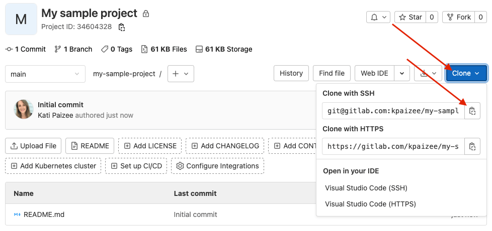
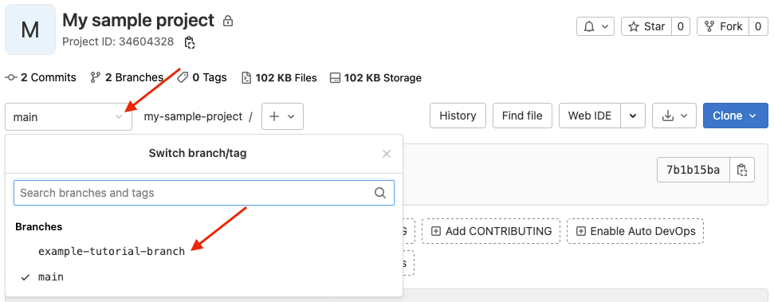

This tutorial will teach you a little bit about how Git works. It walks
you through the steps of creating your own project, editing a file, and
committing changes to a Git repository from the command line.

When you're done, you'll have a project where you can practice using Git.

## Before you begin

- [Install Git on your local machine](../../topics/git/how_to_install_git/_index.md).
- Ensure you can sign in to an instance of GitLab. If your organization doesn't
  have GitLab, create an account on GitLab.com.
- [Create SSH keys and add them to GitLab](../../user/ssh.md). SSH keys are how you
  securely communicate between your computer and GitLab.

## What is Git?

Before we jump into steps, let's go over some basic Git concepts.

Git is a version control system. It's used to track changes to files.

You store files, like code or documents, in a Git *repository*. When you want to edit the files, you
*clone* the repository to your computer, make the changes, and *push* your changes
back to the repository. In GitLab, a Git repository is located in
a *project*.

Each time you push a change, Git records it as a unique *commit*. These commits make up
the history of when and how a file changed, and who changed it.

```mermaid
%%{init: { "fontFamily": "GitLab Sans" }}%%
graph LR
    accTitle: Repository commit history
    accDescr: Flowchart showing linear changes to a repository history

    subgraph Repository commit history
    direction LR
    A(Author: Alex<br>Date: 3 Jan at 1PM<br>Commit message: Added sales figures<br> Commit ID: 123abc12) --->  B
    B(Author: Sam<br>Date: 4 Jan at 10AM<br>Commit message: Removed old info<br> Commit ID: aabb1122) ---> C
    C(Author: Zhang<br>Date: 5 Jan at 3PM<br>Commit message: Added invoices<br> Commit ID: ddee4455)
    end
```

When you work in a Git repository, you work in *branches*. By default, the contents
of a repository are in a default branch. To make changes, you:

1. Create your own branch, which is a snapshot of the default branch at the time
   you create it.
1. Make changes and push them to your branch. Each push creates a commit.
1. When you're ready, *merge* your branch into the default branch.

```mermaid
%%{init: { "fontFamily": "GitLab Sans" }}%%
flowchart LR
    accTitle: Use branches in Git
    accDescr: The flow of creating, then using, a branch in Git

    subgraph Default branch
    A[Commit] --> B[Commit] --> C[Commit] --> D[Commit]
    end
    subgraph My branch
    B --1. Create my branch--> E(Commit)
    E --2. Add my commit--> F(Commit)
    F --3. Merge my branch to default--> D
    end
```

If this all feels a bit overwhelming, hang in there. You're about to see these concepts in action.

## Steps

Here's an overview of what we're going to do:

1. [Create a sample project](#create-a-sample-project).
1. [Clone the repository](#clone-the-repository).
1. [Create a branch and make your changes](#create-a-branch-and-make-changes).
1. [Commit and push your changes](#commit-and-push-your-changes).
1. [Merge your changes](#merge-your-changes).
1. [View your changes in GitLab](#view-your-changes-in-gitlab).

### Create a sample project

To start, create a sample project in GitLab.

1. In GitLab, on the left sidebar, at the top, select **Create new** (**{plus}**) and **New project/repository**.
1. For **Project name**, enter `My sample project`. The project slug is generated for you.
   This slug is the URL you can use to access the project after it's created.
1. Ensure **Initialize repository with a README** is selected.
   How you complete the other fields is up to you.
1. Select **Create project**.

### Clone the repository

Now you can clone the repository in your project. *Cloning* a repository means you're creating
a copy on your computer, or wherever you want to store and work with the files.

1. On your project's overview page, in the upper-right corner, select **Code**, then copy the URL for **Clone with SSH**.

   

1. Open a terminal on your computer and go to the directory
   where you want to clone the files.

1. Enter `git clone` and paste the URL:

   ```shell
   git clone git@gitlab.com:gitlab-example/my-sample-project.git
   ```

1. Go to the directory:

   ```shell
   cd my-sample-project
   ```

1. By default, you've cloned the default branch for the repository. Usually this
   branch is `main`. To be sure, get the name of the default branch:

   ```shell
   git branch
   ```

   The branch you're on is marked with an asterisk.
   Press `Q` on your keyboard to return to the main terminal
   window.

### Create a branch and make changes

Now that you have a copy of the repository, create your own branch so you can
work on your changes independently.

1. Create a new branch called `example-tutorial-branch`.

   ```shell
   git checkout -b example-tutorial-branch
   ```

1. In a text editor like Visual Studio Code, Sublime, `vi`, or any other editor,
   open the README.md file and add this text:

   ```plaintext
   Hello world! I'm using Git!
   ```

1. Save the file.

1. Git keeps track of changed files. To confirm which files have changed, get
   the status.

   ```shell
   git status
   ```

   You should get output similar to the following:

   ```shell
   On branch example-tutorial-branch
   Changes not staged for commit:
   (use "git add <file>..." to update what will be committed)
   (use "git restore <file>..." to discard changes in working directory)
   modified:   README.md

   no changes added to commit (use "git add" and/or "git commit -a")
   ```

### Commit and push your changes

You've made changes to a file in your repository. Now it's time to record
those changes by making your first commit.

1. Add the `README.md` file to the *staging* area. The staging area is where you
   put files before you commit them.

   ```shell
   git add README.md
   ```

1. Confirm the file is staged:

   ```shell
   git status
   ```

   You should get output similar to the following, and the filename should be in
   green text.

   ```shell
   On branch example-tutorial-branch
   Changes to be committed:
   (use "git restore --staged <file>..." to unstage)
   modified:   README.md
   ```

1. Now commit the staged file, and include a message
   that describes the change you made. Make sure you surround the message in double
   quotes (").

   ```shell
   git commit -m "I added text to the README file"
   ```

1. The change has been committed to your branch, but your branch and its commits
   are still only available on your computer. No one else has access to them yet.
   Push your branch to GitLab:

   ```shell
   git push origin example-tutorial-branch
   ```

Your branch is now available on GitLab and visible to other users in your project.



### Merge your changes

Now you're ready to merge the changes from your `example-tutorial-branch` branch
to the default branch (`main`).

1. Check out the default branch for your repository.

   ```shell
   git checkout main
   ```

1. Merge your branch into the default branch.

   ```shell
   git merge example-tutorial-branch
   ```

1. Push the changes.

   ```shell
   git push
   ```

NOTE:
For this tutorial, you merge your branch directly to the default branch for your
repository. In GitLab, you typically use a [merge request](../../user/project/merge_requests/_index.md)
to merge your branch.

### View your changes in GitLab

You did it! You updated the `README.md` file in your branch, and you merged those changes
into the `main` branch.

Let's look in the UI and confirm your changes. Go to your project.

- Scroll down and view the contents of the `README.md` file.
  Your changes should be visible.
- Above the `README.md` file, view the text in the **Last commit** column.
  Your commit message is displayed in this column:

  

Now you can return to the command line and change back to your personal branch
(`git checkout example-tutorial-branch`). You can continue updating files or
creating new ones. Type `git status` to view the status
of your changes and commit with abandon.

Don't worry if you mess things up. Everything in Git can be reverted, and if you
find you can't recover, you can always create a new branch and start again.

Nice work.

## Find more Git learning resources

- Get a complete introduction to Git in the <i class="fa fa-youtube-play youtube" aria-hidden="true"></i> [Git for GitLab](https://www.youtube.com/watch?v=4lxvVj7wlZw) beginner's course (1h 33m).
- Find other tutorials about Git and GitLab on the [tutorials page](../_index.md).
- PDF download: [GitLab Git Cheat Sheet](https://about.gitlab.com/images/press/git-cheat-sheet.pdf).
- Blog post: [Git Tips & Tricks](https://about.gitlab.com/blog/2016/12/08/git-tips-and-tricks/).
- Blog post: [Eight Tips to help you work better with Git](https://about.gitlab.com/blog/2015/02/19/8-tips-to-help-you-work-better-with-git/).
- Official [Git documentation](https://git-scm.com), including
  [Git on the Server - GitLab](https://git-scm.com/book/en/v2/Git-on-the-Server-GitLab).
