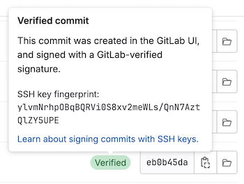
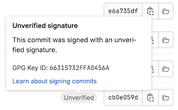

DETAILS:
**Tier:** Free, Premium, Ultimate
**Offering:** GitLab.com, GitLab Self-Managed, GitLab Dedicated

When you add a digital signature to your commit, you provide extra assurance that a commit
originated from you, rather than an impersonator. A digital signature is a cryptographic output
used to verify authenticity. If GitLab can verify a commit author's identity with a public [GPG key](gpg.md),
the commit is marked **Verified** in the GitLab UI. You can then configure
[push rules](../push_rules.md) for your project to reject individual unsigned commits, or reject all
commits from unverified users.

Sign commits with your:

- [SSH key](ssh.md).
- [GPG key](gpg.md).
- [Personal x.509 certificate](x509.md).

## Verify commits

To review commits for a merge request, or for an entire project, and verify they are signed:

1. On the left sidebar, select **Search or go to** and find your project.
1. To review commits:
   - For a project, select **Code > Commits**.
   - For a merge request:
     1. Select **Code > Merge requests**, then select your merge request.
     1. Select **Commits**.
1. Identify the commit you want to review. Depending on the verification status of the signature,
   signed commits display either a **Verified** or **Unverified** badge.

   

   Unsigned commits do not display a badge.

1. To display the signature details for a commit, select **Verified** or **Unverified** to see
   the fingerprint or key ID:

   

   

You can also [use the Commits API](../../../../api/commits.md#get-signature-of-a-commit)
to check a commit's signature.

### Verify commits made in the web UI

GitLab uses SSH to sign commits created through the web UI.
To verify these commits locally, obtain the GitLab public key for signing web commits
using the [Web Commits API](../../../../api/web_commits.md#get-public-signing-key).

### Use gitmailmap with verified commits

> - [Introduced](https://gitlab.com/gitlab-org/gitlab/-/issues/425042) in GitLab 17.5 [with a flag](../../../../administration/feature_flags.md) named `check_for_mailmapped_commit_emails`. Disabled by default.

FLAG:
The availability of this feature is controlled by a feature flag.
For more information, see the history.

The [`gitmailmap`](https://git-scm.com/docs/gitmailmap) feature allows users to map author names and email addresses.
GitLab uses these email addresses to provide links to the commit author.
When using a `mailmap` author mapping, it's possible to have a verified commit with an unverified author email.

For SSH and UI signatures with `mailmap` author mappings, GitLab displays an orange verified label with a warning sign.
To restore the green verified label, verify the mapped email address, or remove the `mailmap` entry.

## Troubleshooting

### Fix verification problems with signed commits

The verification process for commits signed with GPG keys or X.509 certificates
can fail for multiple reasons:

| Value                       | Description | Possible Fixes |
|-----------------------------|-------------|----------------|
| `UNVERIFIED`                | The commit signature is not valid. | Sign the commit with a valid signature. |
| `SAME_USER_DIFFERENT_EMAIL` | The GPG key used to sign the commit does not contain the committer email, but does contain a different valid email for the committer. | Amend the commit to use an email address that matches the GPG key, or update the GPG key [to include the email address](https://security.stackexchange.com/a/261468). |
| `OTHER_USER`                | The signature and GPG key are valid, but the key belongs to a different user than the committer. | Amend the commit to use the correct email address, or amend the commit to use a GPG key associated with your user. |
| `UNVERIFIED_KEY`            | The key associated with the GPG signature has no verified email address associated with the committer. | Add and verify the email to your GitLab profile, [update the GPG key to include the email address](https://security.stackexchange.com/a/261468), or amend the commit to use a different committer email address. |
| `UNKNOWN_KEY`               | The GPG key associated with the GPG signature for this commit is unknown to GitLab. | [Add the GPG key](gpg.md#add-a-gpg-key-to-your-account) to your GitLab profile. |
| `MULTIPLE_SIGNATURES`       | Multiple GPG or X.509 signatures have been found for the commit. | Amend the commit to use only one GPG or X.509 signature. |
